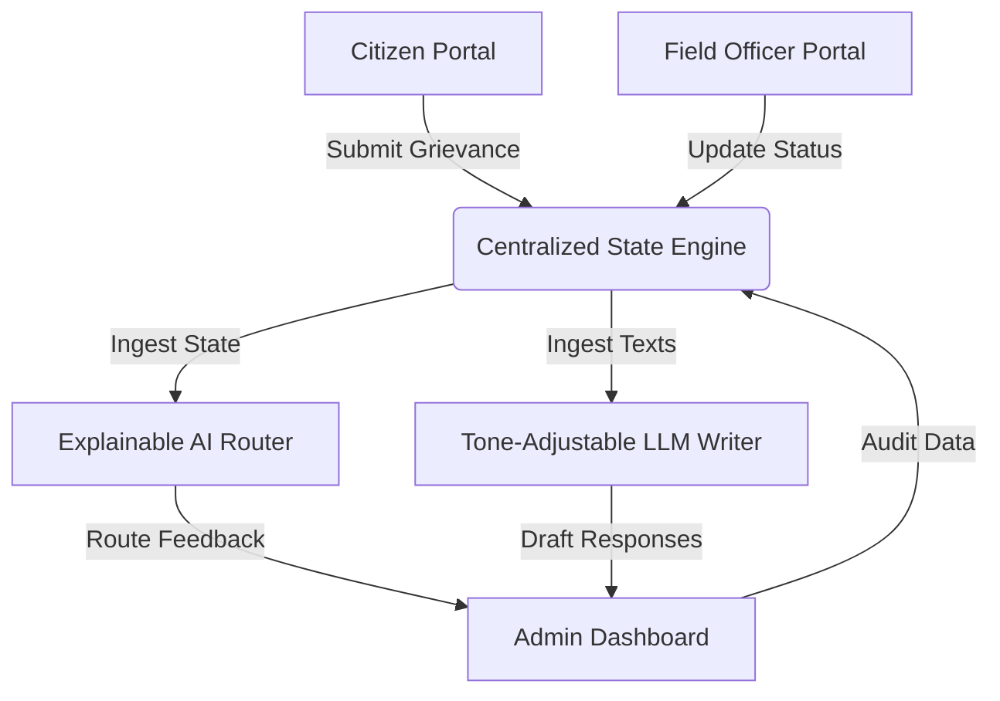

# GovPilot: AI-Powered District Governance & Constituency Management Platform

GovPilot is a professional-grade React, Vite, and TypeScript administrative dashboard and portal designed to streamline communications and bridge operations between **citizens**, **field officers**, and **district administrators**. 

By leveraging simulated **Explainable AI (XAI)** classification pipelines and automated text generation engines, GovPilot accelerates local issue resolution, monitors district sentiment metrics, and boosts governance transparency.

---

## 🚀 Key Portals & Features

### 👤 Citizen Portal
*   **Secure Grievance Filing**: Citizens can quickly report local issues (infrastructure, electricity, water, sanitary).
*   **Media Uploads**: Evidence logging with mock attachment integrations.
*   **Real-time Complaint Tracking**: Clean statuses showing "Submitted", "Assigned", "In Progress", and "Resolved".

### 👷 Field Officer Portal
*   **Priority dispatching**: Automated task queues organized by urgency and distance.
*   **Status Logs**: In-field updates, progress descriptions, and completed inspector signature simulators.

### 🏛️ Administrator / Politician Dashboard
*   **Real-Time Analytics**: Live monitoring of resolution rates, average turnaround times, and incoming ticket frequency.
*   **Speech & Media AI Assistant**: Built-in copywriting engine leveraging simulated Large Language Models (LLMs) with adjustable sliders to shift tones between *Diplomatic*, *Inspiring*, *Assertive*, and *Empathetic* styles.
*   **Policy & Bill Simulator**: Summarizes massive draft bills, indices constituency impacts, and recommends voting positions.
*   **Explainable AI (XAI) Inspector**: Fully interactive dashboard that visually maps why complaints are routed to specific departments, preventing black-box AI bias in public administration.
*   **Constituency Heatmap**: SVG-based geospatial distribution charts highlighting issue density areas.

---

## 🛠️ Technology Stack & Architecture

*   **Frontend Library**: React 19 (TypeScript)
*   **Build Utility**: Vite + Hot Module Replacement (HMR)
*   **Styling**: Tailwind CSS & Lucide React Icons
*   **Routing**: React Router DOM (v7)
*   **State Management**: Context-based global providers (`ComplaintsContext`)
*   **Data Visualization**: Recharts (dynamic bar, line, and radar graphs)
*   **Alert Notifications**: Sonner rich toast notifications



---

## ⚡ Developer Setup

1.  **Clone the Repository**:
    ```bash
    git clone https://github.com/Meera33soundharya/co-pilot.git
    cd co-pilot
    ```

2.  **Install Dependencies**:
    ```bash
    npm install
    ```

3.  **Start Development Server**:
    ```bash
    npm run dev
    ```
    *Open `http://localhost:5173` in your browser to interact with the application.*

4.  **Build Production Bundle**:
    ```bash
    npm run build
    ```

---

## 💼 Resume Bullets (For Portfolio Showcase)

If you are displaying this project on your resume, here are high-impact bullet points you can use:
*   **Architected a Multi-Portal System**: Designed and implemented a responsive, three-tier role architecture (Citizen, Field Officer, Administrator) in React & TypeScript, enabling streamlined issue routing for local district operations.
*   **Simulated AI Speech & Decision Engines**: Developed interactive mock services mimicking LLM tone shifts (via slider interfaces) and Explainable AI (XAI) ticket classification to illustrate transparent automated routing concepts.
*   **Built Interactive Analytical Panels**: Leveraged Recharts and SVG elements to produce dynamic constituency heatmaps, ticket resolution trendlines, and district priority scorecards.
*   **Zero-Trust Security Visualizations**: Documented and simulated secure network flows showing offline local execution options to emphasize privacy-first principles in governmental tech stacks.
